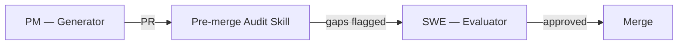

# Example Deck

A sample slide to verify Slidev and Mermaid are working.

---

## Multi-Agent Workflow

---

## Key Insight

- Generator and evaluator must be **separate contexts**
- Automation handles deterministic checks
- Human reviews accountability-sensitive decisions
