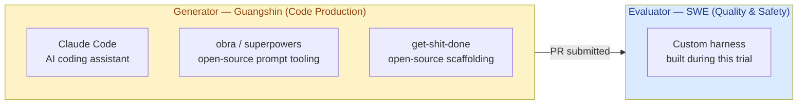
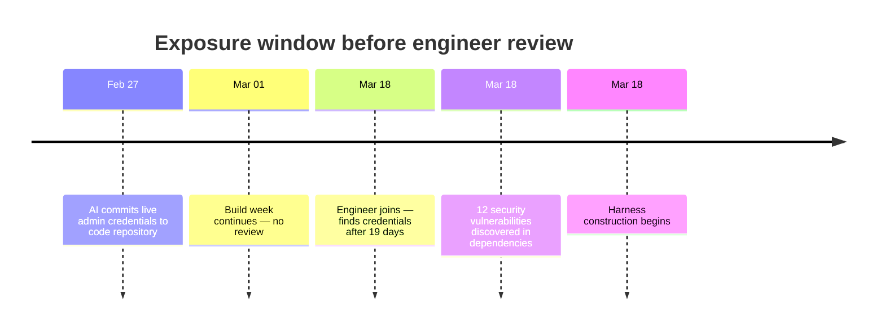
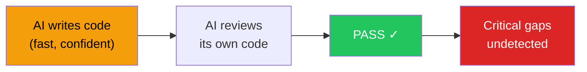
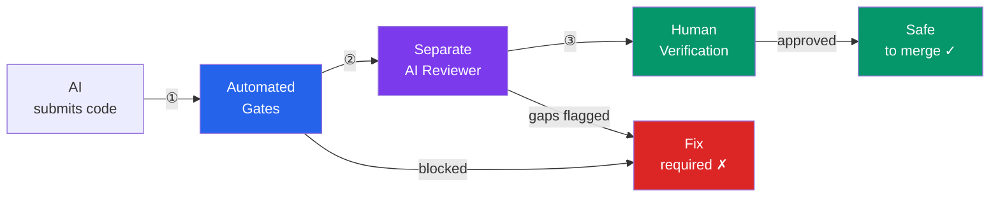
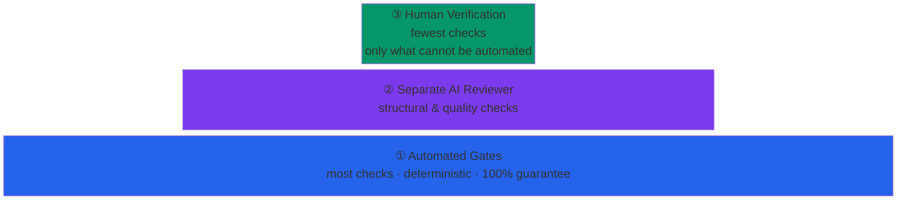
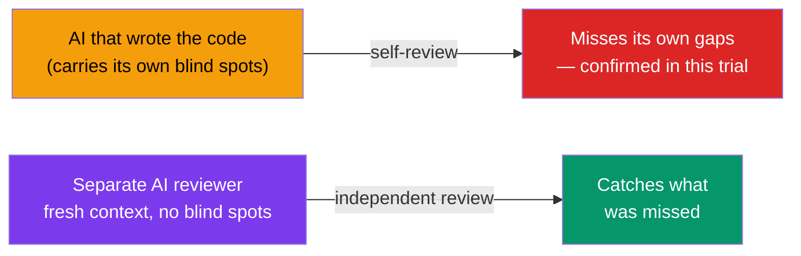
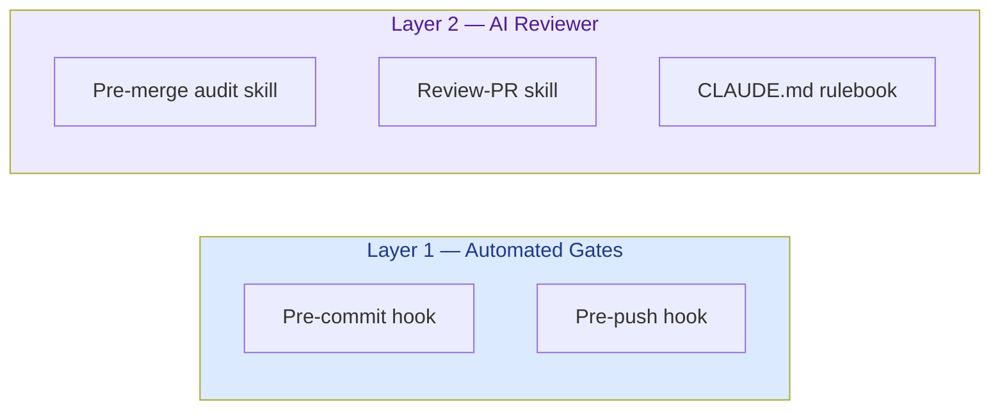
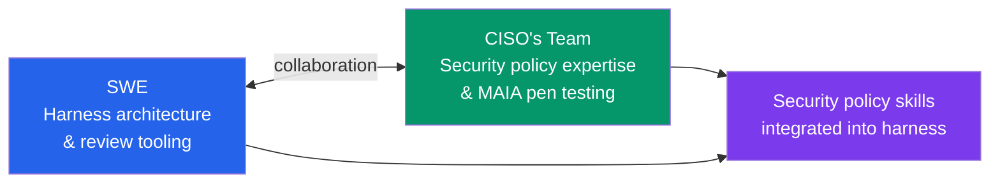
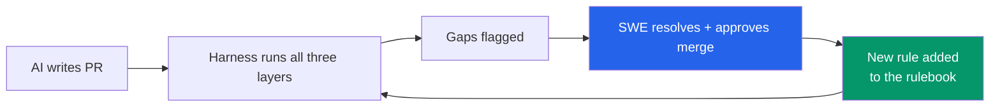
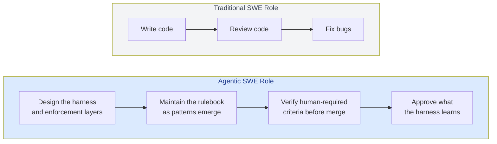

# AI-Assisted Engineering
## Keeping Humans in the Loop

Findings from the SuMs Trial — Natasha Lum, Software Engineer on behalf of Trial Team

---

## Trial Team

| Role | Name |
|---|---|
| Tech Lead | Ivan Foong |
| Product Manager | Guangshin |
| Software Engineer | Natasha Lum |
| DevOps Engineer | Chadin |
| Security Team | Benjamen · Jacky · Loke · Eden |

---

## What We Tested

Guangshin, our product manager, built a production web application using an AI coding assistant — with minimal engineering involvement during the build.

**The question:** Can AI agents build and ship production software reliably?

**The short answer:** Fast, yes. Safe, not without guardrails.

The SuMs trial is our first structured evaluation of this workflow.

---

## Trial Setup — Two Sides of the Workflow



Guangshin was advised by Ivan (tech lead) and diligently used open-source tools — **obra/superpowers** and **get-shit-done** — to strengthen the quality of AI-generated code on the generator side.

**What this trial focused on:** custom harness infrastructure for the **evaluator** — the layer that checks, enforces, and gatekeeps what the generator produces.

**What we did not build:** custom harness infrastructure for the generator itself. The generator side relied entirely on open-source tooling. This is the next frontier — rather than continuing to depend on third-party tools, building purpose-built generator harnesses tailored to our organisation's standards and constraints.

---

## What We Found — Before Any Guardrails

The AI had been building for one month before an engineer reviewed the output.



A live service key — granting full admin access to all project data — sat in plain text in the code repository for **19 days**, undetected.

---

## Why This Happens

**The AI is not malicious. It is optimistic.**



- It prioritises "working code" over "production-ready code"
- It has no awareness of your organisation's security policies unless told
- When asked to check its own work, it tends to confirm quality it should fail

> This is a fundamental property of how these models work — not a bug we can prompt away.

---

## The Answer: A Three-Layer Harness

Rather than instructing the AI to be more careful, we built **automated enforcement**.



Each layer catches a different class of problem. No single layer is sufficient on its own.

---

## Design Principle — The Pyramid

Push as many checks as possible to the automated base. Each layer upward is smaller and reserved only for what the layer below cannot cover.



> If a check can be automated, it should be. Automation gives you guarantees. Everything above it gives you probabilities.

---

## Layer 1 — Automated Gates

These run **every time** a change is submitted. They either pass or block. No exceptions, no override.

| Check | What it catches |
|---|---|
| Secret scanning | Credentials, API keys, passwords committed to code |
| Dependency audit | Known security vulnerabilities in packages |
| Type checking | Code logic that will break in production |
| Automated tests | Regressions in existing functionality |

**Key principle: automation provides guarantees. Instructions to the AI provide probabilities.**

We can now state with 100% confidence that credentials covered by our scanner will not reach the repository.

---

## Layer 2 — Separate AI Reviewer

A second AI agent reads every change against an accumulated rulebook of known failure patterns.



**Why separate?** The same AI that writes code is lenient when asked to check its own work. Separation is the fix — this is backed by Anthropic's own research on multi-agent evaluation.

**The rulebook grows after every review.** Each gap found is codified as a rule. The reviewer gets sharper with every cycle.

---

## Layer 3 — Human Verification

Some things cannot be automated. Every pull request is now classified:

| Label | Meaning |
|---|---|
| `[AUTOMATED]` | Covered by tests — no human action needed |
| `[AGENT E2E]` | AI can simulate the scenario end-to-end |
| `[HUMAN REQUIRED]` | Must be verified by a person before merge |

Login flows, authentication, and environment-sensitive behaviour are **permanently** `[HUMAN REQUIRED]`.

> The harness makes this boundary explicit and enforced — the engineer cannot skip it, and the AI cannot substitute for it.

---

## What This Looks Like in Practice

The following slides show the five concrete artifacts built for SuMs — each mapped to the layer it enforces.



---

## Pre-commit Hook

Runs **automatically on every `git commit`** — before the code can leave the developer's machine.

```
$ git commit -m "feat: add admin script"

  ► Secret scanning (gitleaks)...

  Finding: scripts/create-admin.ts
  Rule:    generic-api-key
  Line 4:  const serviceRoleKey = "eyJhbGciOiJIUzI1NiIsInR5cCI6..."

  ERROR: Secret detected. Commit blocked.
  Rotate the key and move it to an environment variable.

  Commit aborted.
```

---

## Pre-commit Hook — All Checks

| Check | What it blocks |
|---|---|
| `gitleaks` secret scan | Credentials, API keys, tokens |
| `any` cast + ESLint-disable | Type safety bypasses |
| Dockerfile integrity | Missing Prisma schema in Docker image |
| Build-time DB calls | Queries wired to Next.js build step |
| Raw SQL unsafe patterns | SQL injection risk in database queries |
| E2E tests | Regressions in browser-level user flows |

---

## Pre-push Hook

Runs **automatically on every `git push`** — before code reaches the shared repository.

```
$ git push origin feature/otp-resend

  ► Dependency audit (npm audit)...
  found 0 vulnerabilities ✓

  ► Type check (tsc --noEmit)...
  ✓ No type errors

  ► Unit tests (npm test)...
  ✓ 47 passed

  ► DB-related changes detected — running integration tests...
  ✓ 23 passed

  Push accepted.
```

---

## Pre-push Hook — All Checks

| Check | What it blocks |
|---|---|
| `npm audit` | High/critical dependency vulnerabilities |
| `tsc --noEmit` | Code that will not compile in production |
| Unit tests | Regressions in pure logic and utilities |
| Integration tests | Regressions in API routes (when DB files changed) |

---

## Pre-merge Audit Skill

An AI skill run before opening a pull request. It classifies every test criterion so nothing falls through the cracks.

**Three classifications — nothing is unlabelled:**

| Label | Who verifies it | Example |
|---|---|---|
| `[AUTOMATED]` | Husky hooks — no action needed | Secret scan, type check |
| `[AGENT E2E]` | AI runs shell commands and reads output | `.env.example` coverage, orphaned files |
| `[HUMAN REQUIRED]` | A person must execute and observe | Login flow, OTP delivery |

---

## Pre-merge Audit Skill — Human Gate

Every audit ends with this block — it cannot be omitted, even when all automated checks pass.

```
━━━━━━━━━━━━━━━━━━━━━━━━━━━━━━━━━━━━━━━━━━━━━━━━━━
HUMAN TESTING REQUIRED — NOT SATISFIED BY THIS AUDIT
━━━━━━━━━━━━━━━━━━━━━━━━━━━━━━━━━━━━━━━━━━━━━━━━━━
Auth & Login Flow Testing: APPLICABLE

A human tester must complete all [HUMAN REQUIRED]
steps before this branch is merge-ready.

This audit output does NOT satisfy this gate.
━━━━━━━━━━━━━━━━━━━━━━━━━━━━━━━━━━━━━━━━━━━━━━━━━━
```

> A passing audit score does not mean the PR is ready to merge. The human gate is always the final step.

---

## Review-PR Skill

A full pre-merge review run by a **separate AI agent** — independent from the one that wrote the code.

```
TODO LIST
=========
Priority: CRITICAL (blocks merge)
- [ ] fix: remove hardcoded credential in scripts/create-admin.ts
  Source: Phase 3 / gitleaks

Priority: HIGH (must fix before merge)
- [ ] fix build error: waiverReason type unresolved in escalations page
  Source: Phase 4 / npm run build

Priority: MEDIUM (CLAUDE.md violation)
- [ ] fix: replace Record<string, any> with StudyWhereInput in studies page
  Source: Phase 3 / Check B

Priority: LOW (quality / coverage)
- [ ] test: add coverage for "edit prefilled division before submit"
  Source: Phase 2 / test plan step
```

> The skill cannot be run by the same agent that wrote the PR. The separation is the control.

---

## Review-PR Skill — Seven Phases

| Phase | What happens |
|---|---|
| 0 — Rebase | Brings the branch up to date with main before any analysis |
| 1 — PR Analysis | Reads the diff, commits, and test plan |
| 2 — Test Coverage | Maps changed files to expected tests; flags gaps |
| 3 — Code Standards | Scans for CLAUDE.md violations: secrets, type bypasses, orphaned files |
| 4 — Build & Test | Runs unit tests, build, and integration tests |
| 5 — Document | Writes new gaps to the trial review and updates CLAUDE.md |
| 6 — Fix Loop | Works through every flagged item — one commit per fix |

---

## CLAUDE.md — The Rulebook

A plain-text file that tells the AI what is and is not acceptable for this project. It is the accumulated memory of every gap found.

```markdown
## Infrastructure Operations

- **Never apply production infrastructure changes from a local machine.**
  All prod infra changes must go through the CI/CD pipeline.
  If blocked, flag the blocker and wait for human review —
  do not find a workaround.
- **Never modify KMS configurations autonomously.** If a KMS issue
  blocks an infra operation, stop and ask for human review.
  KMS key changes require teardown and re-provisioning if wrong.
- **For any TLS/certificate configuration decision** (global vs regional,
  cert provider, expiry), present the options and ask for explicit
  confirmation before recommending a specific type.
- Local AWS credentials used during agentic infra sessions must be
  scoped to read-only for prod.
```

**How it evolves:** after each review cycle, the Review-PR skill proposes new rules based on gaps it caught that were not yet documented. The SWE approves or rejects each addition. CLAUDE.md grows with the codebase.

---

## CLAUDE.md — What It Constrains

| Category | Example rule |
|---|---|
| Credentials | Never hardcode secrets — read from environment variables |
| Dependencies | Run `npm audit` after every package change; fix all high findings |
| Type safety | No `any` casts — model the correct type or ask |
| Infrastructure | Never apply production changes from a local machine |
| Build | No database calls at Next.js build time |
| Docker | Always `COPY prisma ./prisma` before `RUN prisma generate` |

---

## Built With Your Security Team

The harness was not built in isolation. Benjamen from the CISO's team — who piloted **MAIA**, the organisation's internal AI-assisted penetration testing tool — worked closely with us throughout the trial.



**What this collaboration produced:**

- Security policy skills from Benjamen's team were integrated directly into the harness — encoding the organisation's security standards as enforceable constraints, not just documentation
- A working model for how the SWE harness and the security team's tooling can be co-maintained going forward

> This is the intended direction: the harness is not owned by one function. It is a shared asset that security, engineering, and platform teams contribute to together.

---

## The Self-Improving Loop

The harness gets sharper with every review cycle — without the engineer having to anticipate every future failure mode in advance.



The engineer reviews proposed rule additions and approves or rejects them. **The human remains in the loop on what the harness learns.**

Over time, the rulebook becomes tailored to this codebase and this team's specific patterns — not just generic best practices.

---

## Self-Improving Loop — The Instruction

Phase 5 of the Review-PR skill instructs the AI to update its own rulebook after every review:

```markdown
## Phase 5 — Document Findings

### Update CLAUDE.md

Add or clarify a rule when a TODO item reveals:
- A violation with no corresponding rule in CLAUDE.md
- An existing rule that is ambiguous in a way the violation exposes

Do not duplicate rules already enforced by husky hooks —
CLAUDE.md is the human-readable statement;
the hook is the enforcement.
```

The AI proposes the addition. The SWE approves or rejects it. No rule enters the rulebook without human sign-off.

---

## Self-Improving Loop — Gaps Discovered and Codified

Three rules that did not exist at the start of the trial — each written after the review skill caught a pattern the initial rulebook had not anticipated.

| Gap | What the skill caught | Rule added to CLAUDE.md |
|---|---|---|
| **Q5** | `sendOtp` returning raw OTPaaS JSON blobs (`{"code":2008,...}`) directly to the login UI | Any `lib/` function wrapping an external API must map `!res.ok` to a user-friendly string — never return `res.text()` or raw JSON |
| **T1** | Bug-fix tests asserting only `res.status === 400`, not the corrected error content | Bug-fix tests must assert the corrected content, not only the status code — a test that passes with the broken code is not a covering test |
| **T2** | `getApiKey()` inside the try block — a misconfigured deployment silently returned "Couldn't send code" instead of crashing loudly | Precondition checks (env var validation, config reads) must sit **before** the try block so configuration errors still propagate |

---

## The Shifting Role of the Software Engineer

The SWE's role in an agentic workflow is not the same as in traditional development.



**The most durable contribution is the harness itself.** Individual fixes have a short shelf life. Review infrastructure compounds in value with every cycle.

---

## What the Trial Proved

| Finding | Evidence from the trial |
|---|---|
|  Generator and reviewer agent must be separate | Generator's own audit missed all critical gaps; separate reviewer caught them |
| Automation beats instruction | Secret scanner block is 100%; written instruction to AI is not |
| Human testing is load-bearing | 2 bugs passed all automated checks; caught only by running the app |
| Self-improvement works | Rulebook grew from a starting set to codebase-specific rules across the trial |

**16 gaps remediated** — including the critical 19-day credential exposure. E2E test infrastructure built. Review infrastructure now in place for all future work on this project.

---

## For Leadership

Four things that need to stay true for this model to hold:

1. **Human engineers remain accountable.** The AI assists; the engineer owns the outcome. Communicate this clearly — stakeholder confidence depends on knowing a human is responsible.

2. **Invest in deterministic automation first.** Every check that can be automated should be. Automation gives you guarantees. AI instructions give you probabilities.

3. **Treat the harness as infrastructure.** Review skills and rulesets require ongoing maintenance, like any other piece of critical infrastructure. This is the SWE's primary ongoing contribution.

4. **The SWE role is evolving, not disappearing.** Coding is being augmented. Harness architecture, security policy enforcement, and human accountability are not.

---

## Recommended Next Steps

- [ ] Adopt harness templates from this trial as the baseline for all new agentic projects
- [ ] Provision compliant test environments for grassroots practitioners — removes the incentive to use unsupported cloud environments for user testing
- [ ] Establish review skill maintenance as a shared engineering responsibility and culture — not a one-off setup
- [ ] Continue experimenting with harness engineering on generator agents, and on planner agents

---

## Thank You

Presented by **Natasha Lum** — Software Engineer

| Role | Name |
|---|---|
| Tech Lead | Ivan Foong |
| Product Manager | Guangshin |
| DevOps Engineer | Chadin |
| Security Team | Benjamen · Jacky · Loke · Eden |
