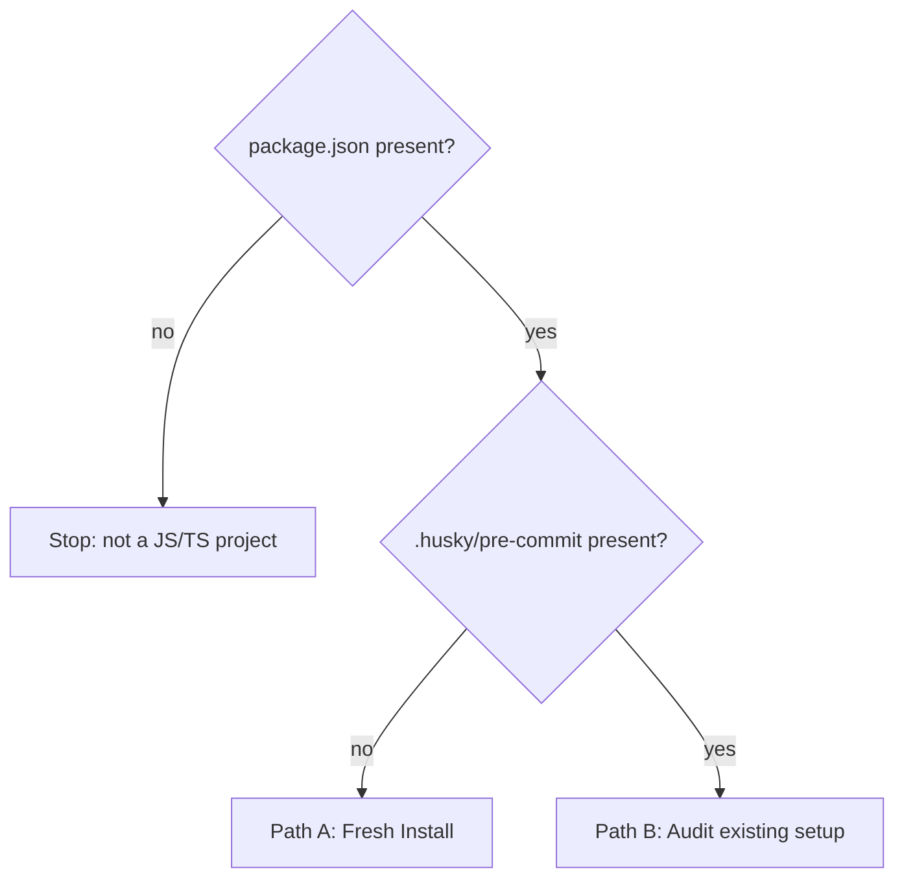

# Git Hooks Setup

## Overview

Installs Husky-based git hooks with idempotent checks.

**Pre-commit minimum:** lint-staged (ESLint + Prettier on staged files), TypeScript type check (full project), gitleaks secrets scan
**Pre-push minimum:** full test suite

Supported package managers: npm, yarn, pnpm, bun.

---

## Phase 0: Assess



---

## Path A: Fresh Install

### Ask before doing anything

Infer from the repo where possible; ask only when unclear:

| Question | How to infer |
|----------|-------------|
| **Package manager** | `package-lock.json` → npm · `yarn.lock` → yarn · `pnpm-lock.yaml` → pnpm · `bun.lockb`/`bun.lock` → bun |
| **TypeScript or JS?** | `tsconfig.json` present or `.ts`/`.tsx` files tracked |
| **Node version manager** | `.nvmrc`/`.node-version` → nvm · `.tool-versions` → asdf · `volta` key in package.json → volta · none found → ask the user |

If the package manager cannot be inferred, ask the user. Do not assume or proceed without it.

If no node version manager can be inferred, ask whether they use one before writing hook files — the answer determines whether a sourcing line is needed at the top of each hook.

### Install Husky

```sh
# npm
npm install --save-dev husky && npx husky init

# yarn
yarn add --dev husky && yarn husky init

# pnpm
pnpm add -D husky && pnpm exec husky init

# bun
bun add -D husky && bunx husky init
```

This creates `.husky/` and adds a `prepare` script to `package.json`. Any additional hook files created manually must be made executable: `chmod +x .husky/<hook-name>`.

### Install required tools

Install as dev dependencies (skip any already present in `package.json`):

| Tool | Purpose |
|------|---------|
| `eslint` | Linting |
| `prettier` | Formatting |
| `lint-staged` | Runs linters on staged files only |
| `typescript` | Type checking (TS projects only) |

Install gitleaks separately (not an npm package):
```sh
brew install gitleaks        # macOS
# Linux: go install github.com/zricethezav/gitleaks/v8@latest
```

Then proceed to **Hook Requirements** to wire up the hooks, and **Config Files** for defaults.

---

## Path B: Audit Existing Setup

First, re-confirm the package manager from the lockfile — you will need it to write hook commands. Then run each check below. Report all failures before making any changes. Never modify a passing item.

### Pre-commit checks

| Check | Pass condition |
|-------|---------------|
| Husky installed | `husky` in `package.json` devDependencies |
| Pre-commit hook exists | `.husky/pre-commit` exists and is executable |
| Hook calls lint-staged | `grep -q 'lint-staged' .husky/pre-commit` |
| Hook calls tsc | `grep -q 'tsc' .husky/pre-commit` (TS projects only) |
| Hook calls gitleaks | `grep -q 'gitleaks' .husky/pre-commit` |
| lint-staged configured | `lint-staged` in devDependencies AND a lint-staged config present (`.lintstagedrc*` or `lint-staged` key in package.json) |
| ESLint configured | Any `.eslintrc.*` or `eslint.config.*` present |
| Prettier configured | Any `.prettierrc*` or `prettier` key in package.json |
| Type check available | `typescript` in devDependencies AND `tsconfig.json` found within 3 dir levels (TS projects only) |
| Secrets scan available | `gitleaks` in PATH AND `.gitleaks.toml` present |

### Pre-push checks

| Check | Pass condition |
|-------|---------------|
| Pre-push hook exists | `.husky/pre-push` exists and is executable |
| Hook calls test runner | `grep -qE 'test|jest|vitest|mocha' .husky/pre-push` |
| Test script present | `test` script defined in `package.json` |

For each failure: add the missing tool, config, or hook content using the reference below.

---

## Hook Requirements

### Pre-commit — what must run

Configure `.husky/pre-commit` to run in this order:

1. **Node version manager bootstrap** — if a version manager is in use, source it at the top of the hook so `node` is available in the non-interactive shell. Use the snippet matching the detected manager:
   ```sh
   # nvm
   export NVM_DIR="$HOME/.nvm"
   [ -s "$NVM_DIR/nvm.sh" ] && \. "$NVM_DIR/nvm.sh"

   # fnm
   eval "$(fnm env --use-on-cd)"

   # volta — no explicit sourcing needed if VOLTA_HOME is in the system PATH
   ```

2. **lint-staged** — ESLint and Prettier on staged `*.{js,jsx,ts,tsx}` files only

3. **TypeScript type check** (TS projects only) — `tsc --noEmit` on the full project (not just staged files — TSC needs the whole graph). `tsconfig.json` must explicitly `exclude` gitignored output dirs — TSC does not read `.gitignore`.

4. **gitleaks** — scans staged changes for secrets; blocks commit if found:
   ```sh
   gitleaks protect --staged
   # if .gitleaks.toml is present, pass: gitleaks protect --staged --config .gitleaks.toml
   ```

### Pre-push — what must run

Configure `.husky/pre-push` to run (with the same version manager bootstrap as pre-commit):

1. **Test suite** — full test suite; block push if any test fails.

   Detect the test runner from `package.json`:
   - `jest` in devDependencies → `npx jest` (or PM equivalent)
   - `vitest` in devDependencies → `npx vitest run`
   - `mocha` in devDependencies → `npx mocha`
   - Existing `test` script defined → use it directly: `npm test` / `yarn test` / `pnpm test` / `bun test`
   - None found → ask the user before writing the hook

---

## Config Files

For each file: if absent, create it with the baseline. If present, check the baseline conditions and add any missing pieces — do not remove or overwrite existing content.

### ESLint

**Baseline:** must extend at least one ruleset; TS projects must include a TypeScript-aware parser.

| Condition | Action |
|-----------|--------|
| No ESLint config found | Create `.eslintrc.json` with `eslint:recommended`, node/es2021 env |
| Config present but no `extends` or `plugins` | Add `"extends": ["eslint:recommended"]` |
| TS project but no `@typescript-eslint` parser | Add `@typescript-eslint/parser` and `@typescript-eslint/eslint-plugin` |

### lint-staged

**Baseline:** must run eslint and prettier on `*.{js,jsx,ts,tsx}` files.

| Condition | Action |
|-----------|--------|
| No lint-staged config and no `lint-staged` key in package.json | Create `.lintstagedrc.json` with `*.{js,jsx,ts,tsx}` → `["eslint --fix", "prettier --write"]` |
| Config present but missing eslint command on JS/TS files | Add `eslint --fix` to the matching glob |
| Config present but missing prettier command on JS/TS files | Add `prettier --write` to the matching glob |

### Prettier

**Baseline:** config must exist (any config is acceptable — formatting preferences vary by team).

| Condition | Action |
|-----------|--------|
| No Prettier config and no `prettier` key in package.json | Create `.prettierrc` with sensible defaults: 100 char width, 2-space indent, single quotes, trailing commas |

### tsconfig.json

**Baseline:** `strict` enabled, `noEmit` set, and common output/generated dirs excluded.

| Condition | Action |
|-----------|--------|
| No tsconfig found | Create with `strict: true`, `noEmit: true`, `exclude: ["node_modules", "dist", "build"]` |
| `strict` not set or false | Add `"strict": true` to `compilerOptions` |
| `noEmit` not set | Add `"noEmit": true` to `compilerOptions` |
| `exclude` absent or missing `dist`/`build` | Add the missing dirs; also scan `.gitignore` for other output dirs and add those too |

### gitleaks

**Baseline:** must extend the default ruleset so known secret patterns are covered.

| Condition | Action |
|-----------|--------|
| No `.gitleaks.toml` | Create with `[extend] useDefault = true` and an `[[allowlist]]` stub |
| Present but no `useDefault = true` | Add `[extend]\nuseDefault = true` |

---

## Adding a New Check

1. Check if the command is already in the hook: `grep -q '<your-command>' .husky/<hook>` — skip if present
2. Append the command to the hook file; make sure the file is executable (`chmod +x`)

---

## Common Mistakes

| Mistake | Fix |
|---------|-----|
| Node commands fail silently in hook | Hooks run in non-interactive shells — source the version manager at the top of the hook (see bootstrap snippet in Hook Requirements) |
| TSC errors on generated or dist files | TSC does not read `.gitignore` — add output dirs to the `exclude` array in `tsconfig.json` |
| TSC only checks staged files | Always `tsc --noEmit` without file args — TSC needs the full project graph |
| Tests skipped when nothing staged | Pre-push runs against the full branch, not staged files — always run the full suite |
| Hook file not executable | `chmod +x .husky/<hook-name>` — git silently skips non-executable hooks |
| Pre-push hook hangs with vitest | `vitest` defaults to watch mode — use `vitest run` or `npx vitest run` explicitly; do not rely on a `test` script that may invoke watch mode |
