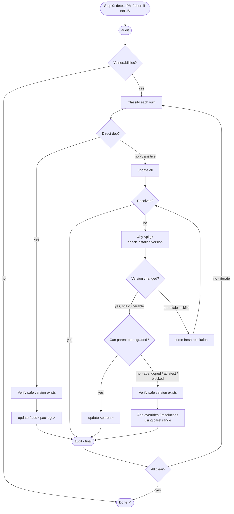

# Updating Vulnerable Dependencies (npm / pnpm / Yarn / Bun)

## Overview

Resolve dependency vulnerabilities with the minimum blast radius, regardless of which package manager the project uses. The escalation order is the same everywhere: **update within range → upgrade the parent → override as a last resort.** Overrides are a last resort and should be removed once the parent ships a fix.

**Avoid freshly-published versions (7-day cooldown).** Supply-chain attacks routinely ship as a brand-new "patch" release of a popular package — a compromised maintainer token or a hijacked publish — and get pulled into projects within hours. Defend against this by never adopting a version that was published in the **last 7 days**. Prefer the oldest patched release that fixes the vulnerability, and let new releases age before you trust them. The one exception is when the *only* version that fixes a real vulnerability is younger than 7 days — then stop and surface the tradeoff to a human (a known CVE vs. an un-aged release) rather than auto-installing either way.

The *workflow* below is identical across package managers — only the *commands* and the *overrides field* differ. The [Command reference](#command-reference) table is the single place that maps each logical step to the concrete command for npm, pnpm, Yarn, and Bun. Read the package manager you detected in Step 0, then follow the steps using that column.

## Step 0: Detect the package manager (and abort if this isn't a JS project)

There is nothing to audit if the repo has no JavaScript/TypeScript dependencies. Bail out early rather than running an audit command that errors or silently does nothing.

Run this detection first:

```bash
# 1. No package.json → not a Node/JS project. Abort.
if [ ! -f package.json ]; then
  echo "No package.json found — this is not a JS/TS project. Nothing to audit."
  exit 0
fi

# 2. package.json exists but declares no dependencies of any kind, and there's no
#    lockfile → nothing is installed to audit. Abort.
has_deps=$(node -e "const p=require('./package.json');\
  const keys=['dependencies','devDependencies','optionalDependencies','peerDependencies'];\
  console.log(keys.some(k=>p[k]&&Object.keys(p[k]).length))" 2>/dev/null)
has_lockfile=$(ls pnpm-lock.yaml yarn.lock bun.lockb bun.lock package-lock.json npm-shrinkwrap.json 2>/dev/null | head -n1)

if [ "$has_deps" != "true" ] && [ -z "$has_lockfile" ]; then
  echo "package.json declares no dependencies and there is no lockfile. Nothing to audit."
  exit 0
fi
```

If you don't have `node` available, inspect `package.json` by reading it: if the `dependencies`/`devDependencies`/`optionalDependencies`/`peerDependencies` objects are all absent or empty **and** no lockfile exists, abort with the same message.

**Then determine which package manager to use**, in priority order:

1. **`packageManager` field** in `package.json` (e.g. `"packageManager": "pnpm@9.1.0"`) — authoritative when present. The prefix before `@` is the package manager.
2. **Lockfile present** (when no `packageManager` field):

   | Lockfile                                | Package manager |
   | --------------------------------------- | --------------- |
   | `pnpm-lock.yaml`                        | pnpm            |
   | `yarn.lock`                             | Yarn            |
   | `bun.lockb` or `bun.lock`               | Bun             |
   | `package-lock.json` / `npm-shrinkwrap.json` | npm         |

3. **No lockfile and no `packageManager` field** → default to **npm** (the most common toolchain) and note the assumption to the user.

If **multiple** lockfiles exist, the `packageManager` field wins; if there's no such field, prefer the lockfile that matches the most recently modified one and flag the ambiguity to the user.

**Yarn classic vs. berry** — these have different commands (see the table). Detect the version:

```bash
yarn --version    # >= 2.0.0 → berry (Yarn 2+).  1.x → classic.
```

A `.yarnrc.yml` file (instead of `.yarnrc`) or a `yarn.lock` that begins with `__metadata:` also indicates berry.

## Command reference

Use the column for the package manager you detected. `<pkg>` is the vulnerable package; `<v>` is a safe version; `<parent>` is the top-level dependency that pulls in `<pkg>`.

| Logical step                        | npm                                       | pnpm                                  | Yarn classic (1.x)              | Yarn berry (2+)                        | Bun                                |
| ----------------------------------- | ----------------------------------------- | ------------------------------------- | ------------------------------- | -------------------------------------- | ---------------------------------- |
| **Audit**                           | `npm audit`                               | `pnpm audit`                          | `yarn audit`                    | `yarn npm audit --all --recursive`     | `bun audit`                        |
| **Show dependency chain**           | `npm why <pkg>` (or `npm ls <pkg>`)       | `pnpm why <pkg>`                      | `yarn why <pkg>`                | `yarn why <pkg>`                       | `bun why <pkg>` (or `bun pm ls`)   |
| **Update all (within ranges)**      | `npm update`                              | `pnpm update`                         | `yarn upgrade`                  | `yarn up "*"`                          | `bun update`                       |
| **Update one (within range)**       | `npm update <pkg>`                        | `pnpm update <pkg>`                   | `yarn upgrade <pkg>`            | `yarn up <pkg>`                        | `bun update <pkg>`                 |
| **Install an exact safe version**   | `npm install <pkg>@<v>`                   | `pnpm add <pkg>@<v>`                  | `yarn add <pkg>@<v>`            | `yarn add <pkg>@<v>`                   | `bun add <pkg>@<v>`                |
| **List published versions**         | `npm view <pkg> versions --json`          | `pnpm info <pkg> versions --json`     | `yarn info <pkg> --json`        | `yarn npm info <pkg> --json`           | `bun pm view <pkg> versions`       |
| **Check dist-tags (latest/next)**   | `npm view <pkg> dist-tags`                | `pnpm info <pkg> dist-tags`           | `yarn info <pkg> dist-tags`     | `yarn npm info <pkg> --json`           | `bun pm view <pkg>`                |
| **Check a version's publish date**  | `npm view <pkg> time --json`              | `pnpm info <pkg> time --json`         | `yarn info <pkg> time`          | `npm view <pkg> time --json`           | `npm view <pkg> time --json`       |
| **Force fresh lockfile resolution** | `rm package-lock.json && npm install`     | `pnpm install --force`                | `yarn install --force`          | `rm yarn.lock && yarn install`         | `bun install --force`              |
| **Run tests**                       | `npm test`                                | `pnpm test`                           | `yarn test`                     | `yarn test`                            | `bun test`                         |
| **Overrides field in package.json** | `overrides`                               | `pnpm.overrides`                      | `resolutions`                   | `resolutions`                          | `overrides`                        |

Notes:

- **Bun's audit** (`bun audit`) and `bun why` require a recent Bun (≈ v1.2+). On older Bun, there is no native audit — install once with `bun install` and run `npm audit` against the resulting tree, or upgrade Bun.
- **Yarn classic `yarn audit`** is read-only (there is no safe `--fix`). Resolve via `yarn upgrade` or `resolutions`.
- Command flags drift between versions. If a command isn't recognized, check `<pm> <subcommand> --help` rather than guessing.

## Decision Flow



## Step 1: Audit

Run the **Audit** command for your package manager. Read the output for each vulnerability:

- **Package** — the vulnerable package name
- **Paths / dependency chain** — `.>parent>vulnerable-pkg` means it's transitive
- **Patched versions** — the minimum safe version

## Step 2: Classify

| Type       | Signal                                                             | Fix path                |
| ---------- | ------------------------------------------------------------------ | ----------------------- |
| Direct     | Package is in your `package.json` `dependencies`/`devDependencies` | Update it directly      |
| Transitive | Appears under a chain in **Paths**                                 | Escalate in order below |

Use the **Show dependency chain** command to see the full path before acting — without it, you risk updating the wrong package.

## Step 3: Verify a safe version exists and is mature enough

Before upgrading or overriding, confirm the patched version is actually published, using the **List published versions** and **Check dist-tags** commands.

Pick the **lowest** published version that satisfies the **Patched versions** requirement from the audit report. Prefer a patch/minor bump over a major version change.

**Then check its publish date** with the **Check a version's publish date** command and apply the 7-day cooldown from the Overview. `npm view <pkg> time --json` returns a `version → ISO-timestamp` map; this command works regardless of package manager because npm ships with Node and reads the same registry. Find your candidate version's timestamp and confirm it is **at least 7 days old**:

```bash
npm view <pkg> time --json     # look up your candidate version's date in the output
# A version is too young if (today − publish date) < 7 days.
# Prefer the oldest version that still satisfies the patched-versions requirement.
```

- If a patched version **≥ 7 days old** exists, use it.
- If the **only** version that fixes the vulnerability was published in the last 7 days, **stop and ask a human.** Lay out the tradeoff explicitly: staying on the known-vulnerable version vs. installing an un-aged release that hasn't had time to be flagged. Do not silently pick either.

**pnpm enforces this natively.** pnpm (≥ 10.16) supports a `minimumReleaseAge` setting (minutes) in `pnpm-workspace.yaml`, which makes pnpm refuse to install versions younger than the threshold across the whole project — a durable guardrail beyond this one fix:

```yaml
# pnpm-workspace.yaml
minimumReleaseAge: 10080   # 7 days, in minutes
```

For npm, Yarn, and Bun, there's no equally universal native setting — rely on the manual publish-date check above (some Bun versions expose a `minimumReleaseAge` in `bunfig.toml`; check your version).

## Step 4: Fix (escalate in order)

### A. Direct dependency — update it

Run **Update one (within range)**. If a major bump is required, use **Install an exact safe version** with the safe version.

### B. Transitive — try updating everything first

Run **Update all (within ranges)**, then **Audit** again. This pulls transitive deps to the newest version allowed by their parents' declared ranges, and often resolves the vulnerability with no further action.

**If the audit still reports the vulnerability**, check whether the installed version actually changed — an update may have bumped a parent but left the transitive entry stale in the lockfile. Run the **Show dependency chain** command to confirm which version is actually installed.

If the installed version is still old despite the parent being updated, the lockfile has a stale entry. Run **Force fresh lockfile resolution**, then **Audit** again.

A forced re-resolution is the right tool here because the stale entry lives in the **lockfile** — it dictates which version is used. Pruning `node_modules` or the package store operates on a different layer and won't change what the lockfile resolves to; the package manager would just re-download the same old version the lockfile still specifies.

**STOP HERE if resolved.** Do not escalate to parent upgrades or overrides until you've confirmed the version did not change after a forced reinstall.

### C. Transitive — upgrade the parent if still unresolved

The parent's declared range may be too narrow to pull in the patched transitive version. Identify the top-level parent with the **Show dependency chain** command, then run **Update one (within range)** on the parent. If a major bump is needed, use **Install an exact safe version**. Re-run **Audit**.

**STOP HERE if resolved.**

### D. Override — last resort only

Use only when the parent **cannot** be upgraded (abandoned, API incompatibility, blocked by other constraints). Add the override to `package.json` using a **caret range** so future patch releases are still applied. The field name depends on the package manager (see the table):

**npm / Bun** — `overrides`:

```json
{
  "overrides": {
    "vulnerable-package": "^<safe-version>"
  }
}
```

**pnpm** — `pnpm.overrides`:

```json
{
  "pnpm": {
    "overrides": {
      "vulnerable-package": "^<safe-version>"
    }
  }
}
```

**Yarn (classic and berry)** — `resolutions`:

```json
{
  "resolutions": {
    "vulnerable-package": "^<safe-version>"
  }
}
```

Then run the package manager's plain install command (`npm install` / `pnpm install` / `yarn install` / `bun install`) and **Audit** again. Document in the PR description why the override was necessary and what prevents a proper upgrade.

## Step 5: Final Verification

Run **Audit** one more time. All vulnerabilities must be resolved. If any remain, document them with a reason (e.g., no upstream fix exists yet).

## Step 6: Run the Test Suite

A clean audit doesn't mean nothing broke. Dependency bumps — especially parent upgrades or overrides — can introduce subtle behavioural regressions even when semver says they shouldn't. Run the full test suite before committing:

```bash
# use the Run tests command for your package manager (see command reference)
npm test   # or pnpm test / yarn test / bun test
```

If tests fail, check whether the failure is in code that touches the updated package. Options in order of preference:

1. **Fix the calling code** — if the new version changed an API and your code used it, update the call site.
2. **Pin to an older patched version** — if a patch within the safe range introduced a regression, pin to the lowest safe version that passes tests.
3. **Do not silence or skip failing tests** — a test failure means the update isn't safe to ship yet.

If the project has no test suite, note that explicitly in the PR description so reviewers know the change is unvalidated.

## Step 7: Clean Up Stale Overrides

Overrides accumulate and rot. After any dependency upgrade cycle, test each entry in the overrides/`resolutions` field for staleness.

**Important:** the **Show dependency chain** command with an override in place always shows the *overridden* version — it cannot tell you whether the override is still needed. You must remove the override and reinstall to see natural resolution.

For each override:

1. Remove it from `package.json`
2. Run the plain install command
3. Check the naturally-resolved version with **Show dependency chain**
4. Run **Audit**
5. If audit is clean → the override is stale, leave it removed
6. If audit reports a vulnerability → restore the override

Keeping stale overrides masks future vulnerabilities and makes dependency trees harder to reason about.

## Common Mistakes

| Mistake                                            | Correct approach                                                                       |
| -------------------------------------------------- | -------------------------------------------------------------------------------------- |
| Running an audit before detecting the PM           | Do Step 0 first — the wrong command errors or no-ops; a non-JS repo should abort early |
| Jumping to overrides for transitive vulns          | Always try the update-all step first — it often resolves without overrides             |
| Using `audit --fix` (or `npm audit fix`) blindly   | It can silently introduce breaking major-version bumps; fix manually                   |
| Skipping the dependency-chain check                | Without knowing the chain, you risk updating the wrong package                         |
| Forgetting the final audit                         | Always re-run audit — a fix for one vuln can reveal others                             |
| Skipping tests after the update                    | A clean audit doesn't mean nothing broke — run the full test suite before committing   |
| Adding transitive deps as direct devDependencies   | Use overrides/`resolutions` instead; don't pollute devDependencies                     |
| Using `>=version` in overrides                     | Use `^version` (caret) so resolution stays within the safe major, not any future major |
| Putting `overrides` where the PM expects `resolutions` (or vice versa) | Match the field to the package manager — npm/Bun use `overrides`, pnpm uses `pnpm.overrides`, Yarn uses `resolutions` |
| Leaving overrides in place permanently             | Check after each upgrade cycle whether the parent now resolves safely on its own       |
| Overriding before confirming a safe version exists | Check published versions / dist-tags first to confirm the patched release exists       |
| Installing a version published in the last 7 days  | Apply the cooldown — prefer the oldest patched release; if only a fresh version fixes it, ask a human before installing |
